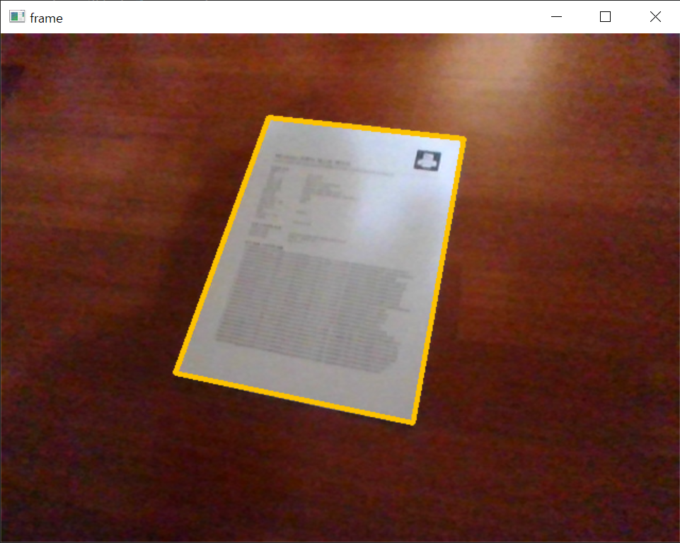

# cam2file

Save the document in real world as the file using webcam.

## Installation

```
% python -m pip install cam2file
```

## Usage

- Import package

```py
import cam2file as c2f
```

- Capture paper

```py
from cam2file import handle_image

path = './result.png'
handle_image(path) # Image will be saved on the path
```

- Get the paper frame in the code

```py
from cam2file import capturePaper
import cv2

res = capturePaper() # Return frame of paper image
cv2.imshow('Result', res)
cv2.waitKey()
cv2.destroyAllWindows()
```

When you call `capturePaper()`, The webcam will be activated as below:



If the paper is detected, Yellow border indicates it. Press `a` then it will be captured.
The result is transformed as A4 size, so it can be distorted if you capture paper which size is not A4.

```py
capturePaper('x')
capturePaper(ok_key='x') # same as above
```

If you want to change the confirm key, pass a character as an argument `ok_key`.

## References

- vyom_garg, "Python | Detect Polygons in an Image using OpenCV", GeeksforGeeks, 19. 10. 13., https://www.geeksforgeeks.org/python-detect-polygons-in-an-image-using-opencv/, 22. 12. 04.
- Daehee Yun, "Python OpenCV 강좌 : 제 21강 - 윤곽선 검출", Daehee YUN Tech Blog, 19. 02. 09., https://076923.github.io/posts/Python-opencv-21/, 22. 12. 04.
- KIDO, "Python Package 생성 및 배포하기", DEVOCEAN, 22. 01. 12., https://devocean.sk.com/blog/techBoardDetail.do?ID=163566, 22. 12. 13.
